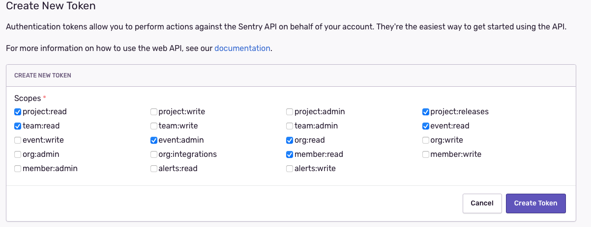
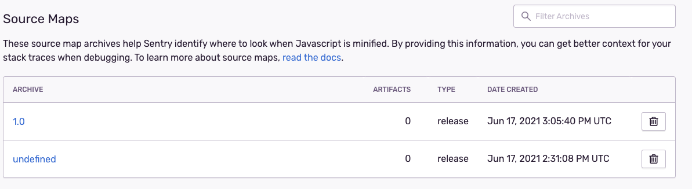
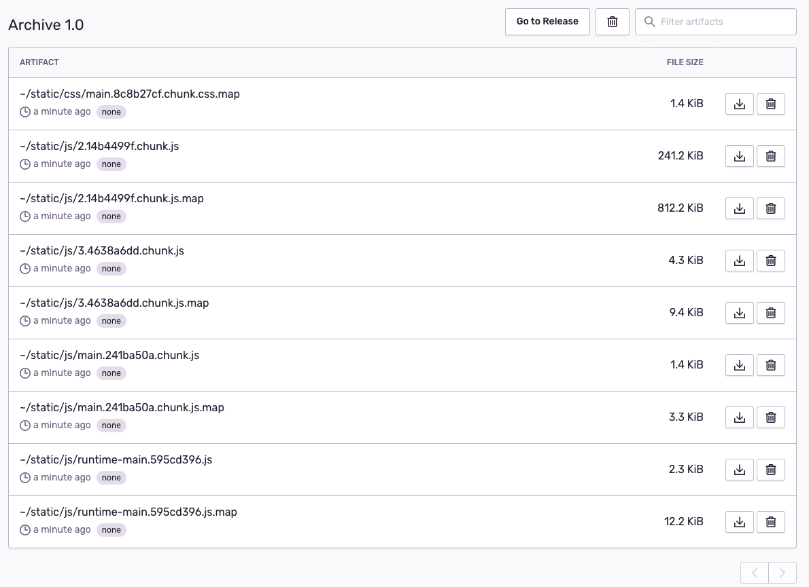
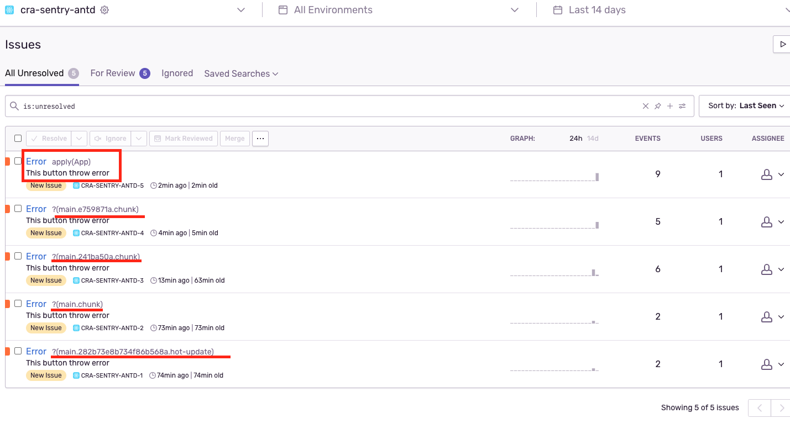
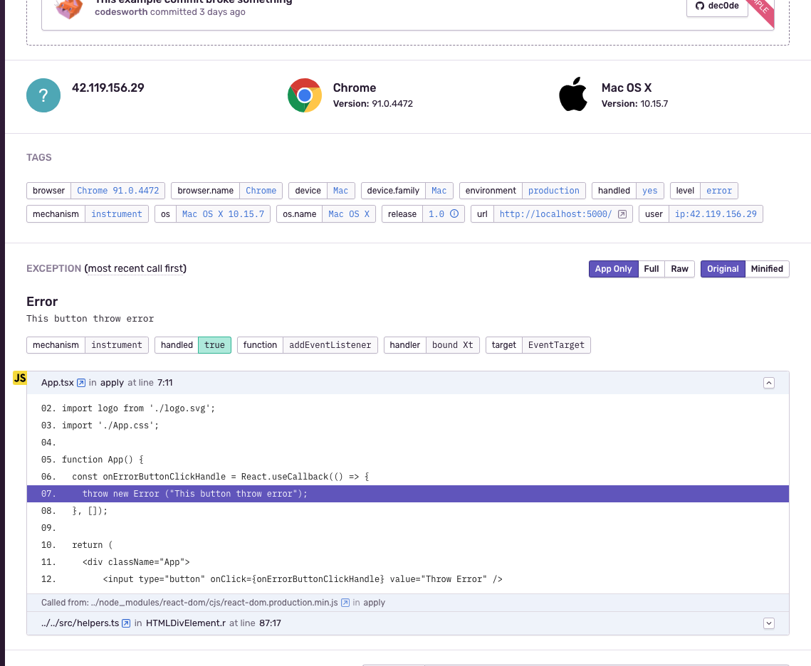

# Testing CRA + Typescript + Sentry + Antd

## Initial CRA Project + TypeScript
Run command
```
npx create-react-app cra-sentry-antd --template typescript
```
References: https://create-react-app.dev/docs/getting-started/

## Add Sentry
Install these packages
- @sentry/react
- @sentry/tracing

Actually, inserted these code into src/index.tsx
```
import * as Sentry from "@sentry/react";
import { Integrations } from "@sentry/tracing";

Sentry.init({
  dsn: "your_dns",
  release: "my-project-name@" + process.env.npm_package_version,
  integrations: [new Integrations.BrowserTracing()],

  // We recommend adjusting this value in production, or using tracesSampler
  // for finer control
  tracesSampleRate: 1.0,
});
```
References: https://docs.sentry.io/platforms/javascript/guides/react/

For testing sentry catch error, add these code into src/App.tsx
```
function App() {
  const onErrorButtonClickHandle = React.useCallback(() => {
    throw new Error ("This button throw error");
  }, []);

  return (
    <div className="App">
      <input type="button" onClick={onErrorButtonClickHandle} value="Throw Error" />
    </div>
  );
}
```

Until this step, our website can send error to Sentry. But error code is difficult to understand now.


## Upload sourcemap for understand error detail on Sentry

### Customize webpack configuration
Install this package for customize webpack configuration
```
yarn add --dev @sentry/webpack-plugin
```

Actually add these code into `webpack.config.js` file
```
const SentryWebpackPlugin = require("@sentry/webpack-plugin");

module.exports = {
  // other configuration
  configureWebpack: {
    plugins: [
      new SentryWebpackPlugin({
        // sentry-cli configuration
        authToken: process.env.SENTRY_AUTH_TOKEN,
        org: "org-name",
        project: "pj-name",
        release: process.env.SENTRY_RELEASE,

        // webpack specific configuration
        include: ".",
        ignore: ["node_modules", "webpack.config.js"],
      }),
    ],
  },
};
```

Reference: https://docs.sentry.io/platforms/javascript/sourcemaps/?_ga=2.206739920.21313716.1623939887-509917532.1623939887&_gac=1.83761636.1623939887.Cj0KCQjw5auGBhDEARIsAFyNm9HnOvMcZAQSaRFtwXDy7fTiXRfibmSiojNAi0PXjM0lAsjgo0ggdCUaArc1EALw_wcB

### Install sentry-cli
Run command
```
curl -sL https://sentry.io/get-cli/ | bash
```

Test installation version by run command
```
ats-MacBook-Pro-2:cra-sentry-antd trantiendat$ sentry-cli --version
```

My version is: `sentry-cli 1.66.0`

References: https://docs.sentry.io/product/cli/installation/

### Login into sentry-cli

Run command and follow steps to login
```
sentry-cli login
```

After logon successfully, cli require input sentry token, please create new token on sentry website, then input into cli. 
I settings default permission for token same as below.



Open file ~/.sentryclirc and add org value into
```
[defaults]
org=my-org
project=my-project

[auth]
token=my-token
```

### Build project
Run command to build project
```
yarn build
```

It'll compile code and generate "build" folder.

### Create release and upload source map to Sentry
Run command for create new release to Sentry
```
sentry-cli releases -o my-org new -p my-project 1.0
```

It'll create new version in Sentry same as image below


Run command for upload "build" folder to source maps in Sentry
```
sentry-cli releases files "1.0" upload-sourcemaps build
```

Result log
```
> Found 9 release files
> Analyzing 9 sources
> Rewriting sources
> Adding source map references
> Bundled 9 files for upload
> Uploaded release files to Sentry
> File upload complete (processing pending on server)

Source Map Upload Report
  Minified Scripts
    ~/static/js/2.14b4499f.chunk.js (sourcemap at 2.14b4499f.chunk.js.map)
    ~/static/js/3.4638a6dd.chunk.js (sourcemap at 3.4638a6dd.chunk.js.map)
    ~/static/js/main.241ba50a.chunk.js (sourcemap at main.241ba50a.chunk.js.map)
    ~/static/js/runtime-main.595cd396.js (sourcemap at runtime-main.595cd396.js.map)
  Source Maps
    ~/static/css/main.8c8b27cf.chunk.css.map
    ~/static/js/2.14b4499f.chunk.js.map
    ~/static/js/3.4638a6dd.chunk.js.map
    ~/static/js/main.241ba50a.chunk.js.map
    ~/static/js/runtime-main.595cd396.js.map
```

When access to sentry, you can see artifacts (source code, source map files) on Sentry


Run source code and throw error, now we can debug error code on Sentry


